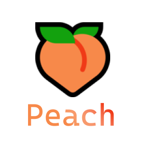

<p align="center">

</br>
<h1>🍑 Peach</h1>
<strong>A sweet Scoop bucket.</strong>
</br>
</br>
<blockquote>你在想屁吃？</blockquote>
</p>

## Usage

```powershell
scoop bucket add peach https://github.com/ChungZH/peach
# Recommended, but you can omit the bucket name most of the time
scoop install peach/<app>
```

## Manifests

If you favorite applications aren't included, you can [submit an issue](https://github.com/ChungZH/peach/issues/new) or make a pull request!

- [**notepanda**](https://github.com/ChungZH/notepanda) - 📃 A simple cross-platform notepad. Based on Qt and C++.
- [**tencent-edu**](https://ke.qq.com/) - 腾讯课堂 PC 客户端
- [**lemon**](https://github.com/iotang/Project_LemonLime) - 为了 OI 比赛而生的轻量评测系统
- [**vivetool**](https://github.com/thebookisclosed/ViVe) - C# library and console app for new feature control APIs coming in Windows 10 version 20H1
- ~~fluent-reader~~ (Moved to [`extras`](https://github.com/lukesampson/scoop-extras/pull/4450))
- [**parsify**](https://parsify.app/) - Extendable calculator ⚡
- [**caret**](https://caret.io) - Markdown editor
- ~~abricotine~~ (Moved to [`extras`](https://github.com/lukesampson/scoop-extras/pull/4453))
- [**gitify**](https://www.gitify.io/) - GitHub notifications on your menu bar ([`extras` pending](https://github.com/lukesampson/scoop-extras/pull/4455))
- [**qtpass**](https://qtpass.org/) - QtPass is a multi-platform GUI for [pass](https://www.passwordstore.org/). ([`extras` pending](https://github.com/lukesampson/scoop-extras/pull/4465))
- [**translatium**](https://translatiumapp.com/) - Translate Any Languages like a Pro
- [**kanmail**](https://kanmail.io/) - Kanmail is an email client that works like a kanban board
- [**drawio**](https://github.com/jgraph/drawio-desktop) - Official electron build of diagrams.net

---

🍑

Made with ❤ by ChungZH

> [Blog](https://chungzh.cn) · [Portfolio](https://chungzh.cc) · [GitHub](https://github.com/ChungZH)
